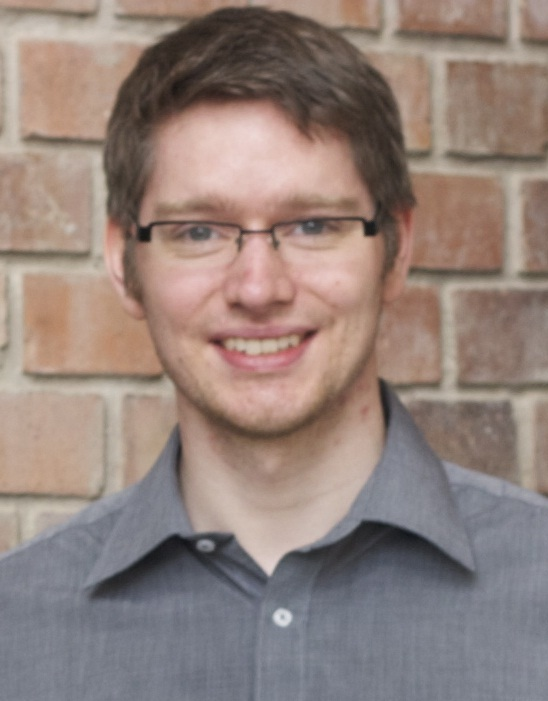

### Research Associate, University of Glasgow

 Sebastian received his German Diplom (MSc. equivalent) in Computer Science and Electrical Engineering from the Technical University of Dortmund in 2010, and for his work on recognising manipulation actions and methods for fusing data from video and embedded accelerometers, he was awarded his PhD in Computing from the University of Dundee in 2014. He continued his research as postdoctoral research assistant in Dundee before joining the University of Glasgow as Research Associate in 2016.

His interests are in intelligent interactive systems, spanning areas of HCI, ubiquitous computing, action recognition, computer vision and machine learning. 

[Publications on Google Scholar](https://scholar.google.com/citations?user=Lr28ImIAAAAJ)

### Students
 - Keri Anderson (PhD, second supervisor)
 - [Evdoxia Taka](http://www.dcs.gla.ac.uk/~evdoxia/) (PhD, second supervisor)
 - [Valentin Charvet](https://www.dcs.gla.ac.uk/~valentin/aboutme/) (PhD, second supervisor)

### Current Project Involvement
 - EPSRC funded project: £3M, 2018-2022:  Closed-Loop Data Science for Complex, Computationally- and Data-Intensive Analytics, EP/R018634/1, [[website]](https://www.gla.ac.uk/schools/computing/research/researchsections/ida-section/closedloop/)
 
### Past Project Involvement
- EPSRC funded project: £113k, July-Nov 2020: Fast multi-shot epidemic interventions for post lockdown Covid-19 mitigation: Open-loop mitigation strategies, EP/V018450/1, [[website]](http://www.dcs.gla.ac.uk/~rod/covid/default.htm) [[demo]](http://samoa.dcs.gla.ac.uk/covid19dashboard/2020_10_06_group_siqr)
 - EPSRC funded project: £23, 2014-2020: QuantIC - Quantum Technology Hub in Quantum imaging, EP/M01326X/1, [[website]](https://quantic.ac.uk)
 - EC Horizon 2020 funded project: €3.5M, 2015-2018: MoreGrasp, H2020-643955, [[website]](http://www.moregrasp.eu) [[video]](https://www.youtube.com/watch?v=MH9SMgIatGI)
 - EPSRC funded project: £1.3M, 2013-2017: BESiDE - The Built Environment for Social Inclusion in the Digital Economy, EP/K037293/1, [[website]](https://www.beside.ac.uk)
 - RCUK Digital Economy Programme funded project: £12, 2009-2015: Social Inclusion through the Digital Economy, EP/G066019/1 
