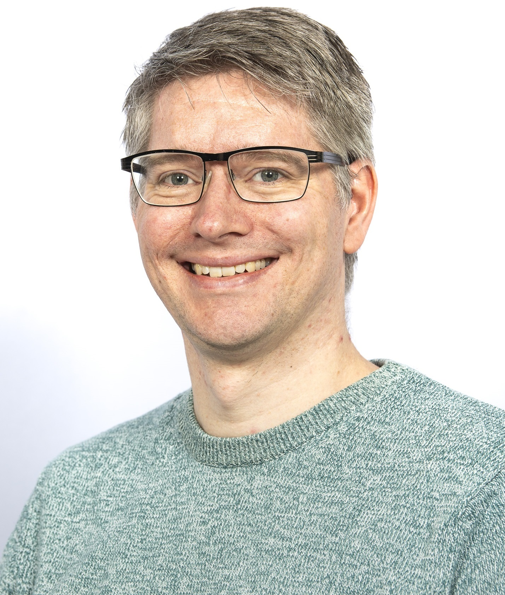

### Research Fellow, University of Glasgow

 Sebastian is a Research Fellow in the School of Computing Science at the University of Glasgow. His research focus is on shared autonomy (human-in-the-loop Bayesian optimization, intelligent interactive systems, assistive technology) and intelligent agents (active inference, reinforcement learning), with interests in HCI, ubiquitous computing and machine learning.

He received his German Diplom (MSc. equivalent) in Computer Science and Electrical Engineering from the Technical University of Dortmund in 2010. He was awarded his PhD in Computing from the University of Dundee in 2014 for his work on recognising manipulation actions and methods for fusing data from video and embedded accelerometer. He continued his research as postdoctoral research assistant in Dundee before joining the University of Glasgow as Research Associate in 2016 and continuing in Glasgow as Research Fellow in 2023.

[Publications on Google Scholar](https://scholar.google.com/citations?user=Lr28ImIAAAAJ)

<!-- ### !! VACANCIES !! -->

### Vacancies

**Ph.D. studentship with Aegean Airlines.** [*Model-based shared autonomy via active inference*](https://difai-project.org/aegeanphd.html), Supervised by Sebastian Stein and Roderick Murray-Smith. Application deadline, 30th April 2025. Fully funded PhD studentship (fees + stipend at [research council rates](https://www.ukri.org/what-we-do/developing-people-and-skills/find-studentships-and-doctoral-training/changes-to-the-minimum-stipend-from-1-october-2023/). For 2024-25 the stipend is £19237 per year. The stipend is usually non-taxable and does not need to be paid back.). This studentship is available to all candidates including international students.

### Students
 - Ho Suen (PhD started in 2024, I am his second supervisor)
 

#### past student supervision
  - [Keri Anderson](https://twitter.com/KeriAnderson_) PhD graduated in Summer 2025, I was her second supervisor
  - [Valentin Charvet](https://www.dcs.gla.ac.uk/~valentin/aboutme/) PhD graduated in Summer 2025, I was his second supervisor
  - [Evdoxia Taka](http://www.dcs.gla.ac.uk/~evdoxia/) PhD graduated in Winter 2023, I was her second supervisor
  - [Joseph Agrane](https://www.linkedin.com/in/joseph-agrane-5aa916213/) EPSRC Vacation Intern, June-August 2023 [[project description]](https://www.gla.ac.uk/colleges/scienceengineering/students/epsrcvacationinternships2023/anevaluationofmodel-basedmethodsforcontrolindriverlessracing/)
 
### Current Project Involvement
 - ERC Advanced Grant (PI: [Roderick Murray-Smith](http://www.dcs.gla.ac.uk/~rod/)), 2023-2028:  Designing Interaction Freedom via Active Inference [[Press Release]](https://www.gla.ac.uk/news/headline_933340_en.html) [[website]](https://difai-project.org/) [[intro video]](https://www.youtube.com/watch?v=cMV89ojnfxk)
 
#### past project involvement
 - EPSRC funded project, 2018-2023: Closed-Loop Data Science for Complex, Computationally- and Data-Intensive Analytics, EP/R018634/1, [[website]](https://www.gla.ac.uk/schools/computing/research/researchsections/ida-section/closedloop/)
 - EPSRC funded project, July-Nov 2020: Fast multi-shot epidemic interventions for post lockdown Covid-19 mitigation: Open-loop mitigation strategies, EP/V018450/1, [[website]](http://www.dcs.gla.ac.uk/~rod/covid/default.htm) [[demo]](http://samoa.dcs.gla.ac.uk/covid19dashboard/2020_10_06_group_siqr)
 - EPSRC funded project, 2014-2020: QuantIC - Quantum Technology Hub in Quantum imaging, EP/M01326X/1, [[website]](https://quantic.ac.uk)
 - ERC Horizon 2020 funded project, 2015-2018: MoreGrasp, H2020-643955, [[website]](http://www.moregrasp.eu) [[video]](https://www.youtube.com/watch?v=MH9SMgIatGI)
 - EPSRC funded project, 2013-2017: BESiDE - The Built Environment for Social Inclusion in the Digital Economy, EP/K037293/1, [[website]](https://www.beside.ac.uk)
 - RCUK Digital Economy Programme funded project, 2009-2015: Social Inclusion through the Digital Economy, EP/G066019/1 
